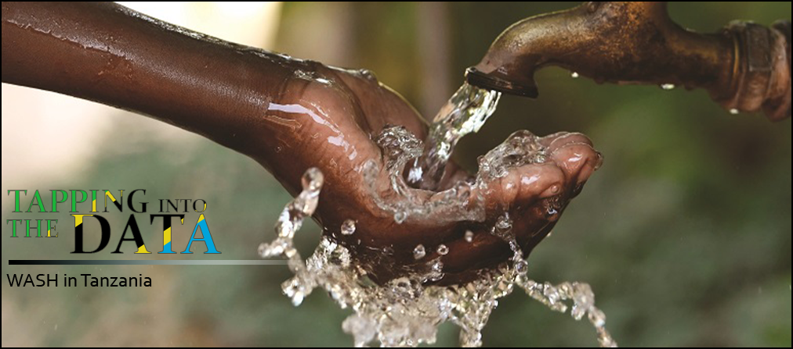
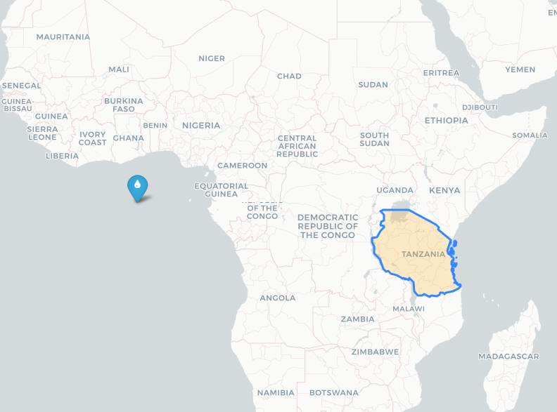
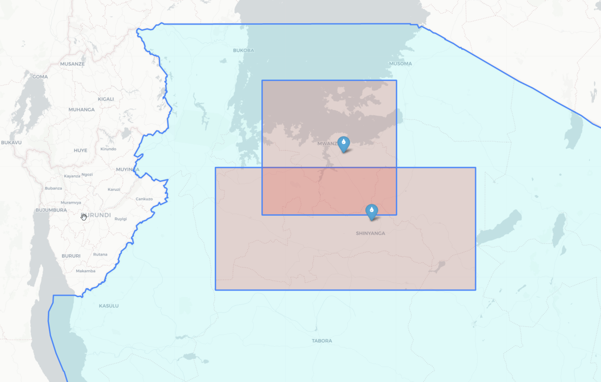
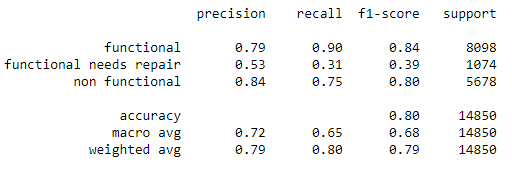

# Tapping into the Data

## Battling Water Poverty in Tanzania

 

### Author:


- Saad Saeed: 
[LinkedIn](https://www.linkedin.com/in/saadsaeed85/) |
[GitHub](https://github.com/ssaeed85) |
[Email](mailto:saadsaeed85@gmail.com)

# Business Problem:

>According to WHO, one out of six people lack access to safe drinking water in Tanzania (WHO/UNICEF, 2004).\
-https://projectzawadi.org/water-shortage/

> It is estimated that Tanzania spends 70 per cent of its health budget on preventable WASH _(Water, Sanitation and Hygiene)_ -related diseases as the majority of the population does not have access to improved sanitation, and close to half of the population does not have access to clean drinking water.\
-https://www.unicef.org/tanzania/what-we-do/wash

Resolving the water poverty crisis has been an ongoing agenda for the Tanzanian government water body for decades now. The Tanzanian government in conjunction with various charity efforts and the villages themselves has made major strides in improving the life of the Tanzanian people.

>In the year 2000, 73 percent of Tanzanians were living without basic access to safe water. The most up-to-date numbers from 2017 show that the percentage was nearly halved and continues to fall.\
-https://lifewater.org/blog/tanzania-water-crisis-facts/

Looking at past water well data, I believe we can help the Tanzanian government get closer to its 2025 vision of improved sanitation to 95 per cent of its people. I believe a predictive model that helps identify water wells in a state of disrepair can help the Tanzanian water body better allocate its resources.

# Data:

To load the data in your local directory please refer to [GetDatasets](Notebook_GetDataSets.ipynb) notebook.

The data was gathered from [drivendata.com](https://www.drivendata.org/competitions/7/pump-it-up-data-mining-the-water-table/) who in turn had gathered it from Taarifa and the Tanzanian Ministry of Water. The dataset covers nearly 60,000 different water well sites across the years going as far back as 1960. 

Each record has a total of 39 input features. Each record has multiclass label to predict for the output. The well sites are labeled either _'functional'_, _'functional needs repairs'_, or _'non-functional'_.

The goal is to be able to predict with a level certainty the operating conditions of a well site given its details.

For a detailed analysis of the dataset please refer to [DataExploration](Notebook_DataExploration.ipynb) notebook.

# Hurdles:


One of the major hurdles to overcome is the class imbalance in the well site status.

The other big challenge in this dataset has been to account for incomplete data or missing data. Of the 39 possible features we narrowed it down to 16 potentially viable candidates. We can go into the details of some of the challenges faced in this subset. 

35% of the records have a construction year of 0 AD. This is a clear flag of 0 being used as a flag for missing or erroneous recording. We were able to impute this to a median construction year value.

1800 water well sites share the same GPS coordinates and have a recorded location off the west coast of Africa.



All of these sites are associated with wellwater projects in the northern Tanzania in the regions of Mwanza and Shinyanga. We resolved this by using median coordinate values in each of these regions.



We understand that data gathering and standardization of data being gathered is ongoing effort. We just want to emphasize the value of good data. With better and more accurate data, our model predictions should improve significantly.


# Methodology:


A variety of different data science techniques were used to improve estimation.

I started off with a Dummy Classifier to help establish a baseline to compare all future models against. After this I tried a variety of different algorithms hypertuning them where I felt necessary. The specific methods used are:
- Logistic Regression
- Random Forest Classifier
- k-Nearest Neighbors Classifier
- XGBoost Random Forest Classifer

I also employed SMOTE on a few hypertuned parameters to help with the class imbalance.

To see the detailed modeling process please refer to the [DataModeling]

Using an iterative process we were able to find our final model in a hypertuned XGBoost Random Classifier. The classification report for this is as follows.



-   Our overall classification accuracy is about 80% 
- The F1-score associated with 'functional' status group is 84%
- The F1-score associated with 'non functional' status group is 80%
- The F1-score associated with 'functional needs repair' is about 39%. 


One area we really need to improve on is our ability to predict water well sites that are in need of repair. 

We can improve with more data associated with sites like these or further researching how to handle class imbalances.

# Further steps:

- Given more time we'd like to look into how the remoteness/accessibility of how a water well site compared to its region of origin has an effect on our predictive capabilities
- Try to improve our predictions on water wells that need repairs so we can address issues before failure
- Implement a time series model to help predict when a water well might fail
- Oversampling our underrepresented data.


## Repository Structure
```
├── Workspace 
├── src 
│     ├── pandas_helper.py
│     └── sklearn_helper.py
├── models 
├── maps
├── data
│     ├── feature_desc.md
│     ├── stanford-gn214np6763-geojson_nationalBoundary.json
│     └── stanford-tn398yw9512-geojson_districtBoundary.json
├── images
│     ├── confusion_matrices
│     └── normalized_confusion_matrices 
│    
├── README.md
├── LICENSE
│ 
├── Notebook_DataExploration.ipynb
├── Notebook_GetDataSets.ipynb
├── Notebook_Modeling.ipynb
├── Slides_Price_Prediction_and_Analysis_in_KingCounty.pdf
│ 
└── .gitignore
```


# References and Citations:

[machinelearningmastery.com/save-load-machine-learning-models-python-scikit-learn](https://machinelearningmastery.com/save-load-machine-learning-models-python-scikit-learn/)\
[towardsdatascience.com/coding-a-custom-imputer-in-scikit-learn](https://towardsdatascience.com/coding-a-custom-imputer-in-scikit-learn-31bd68e541de)\
[geodata.lib.berkeley.edu - national and district boundaries geojson](https://geodata.lib.berkeley.edu/catalog/stanford-gn214np6763 )\
[autogis-site.readthedocs - for handling shape files](https://geodata.lib.berkeley.edu/?utf8=%E2%9C%93&search_field=all_fields&q=tanzania)
[geoportal.icpac.net - riverways geojson](http://geoportal.icpac.net/layers/geonode%3Atza_water_lines_dcw)\
Image used in banner is property of [constructionreviewonline.com](https://constructionreviewonline.com/news/tanzania/usaid-to-fund-tanzania-water-projects/)